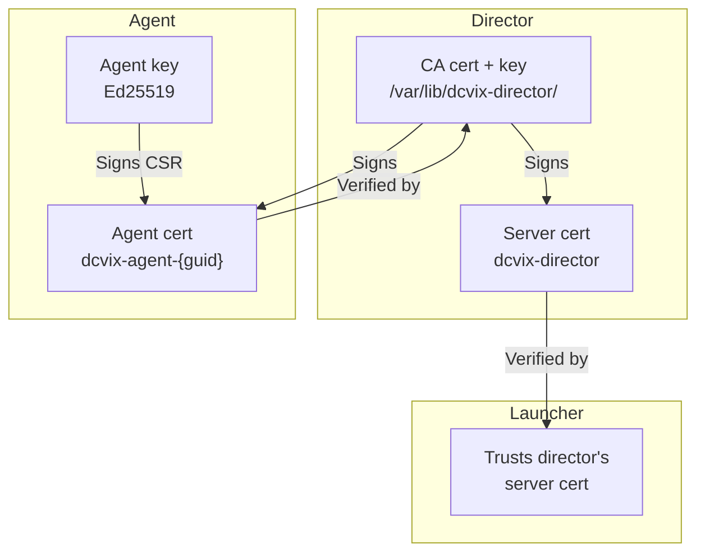
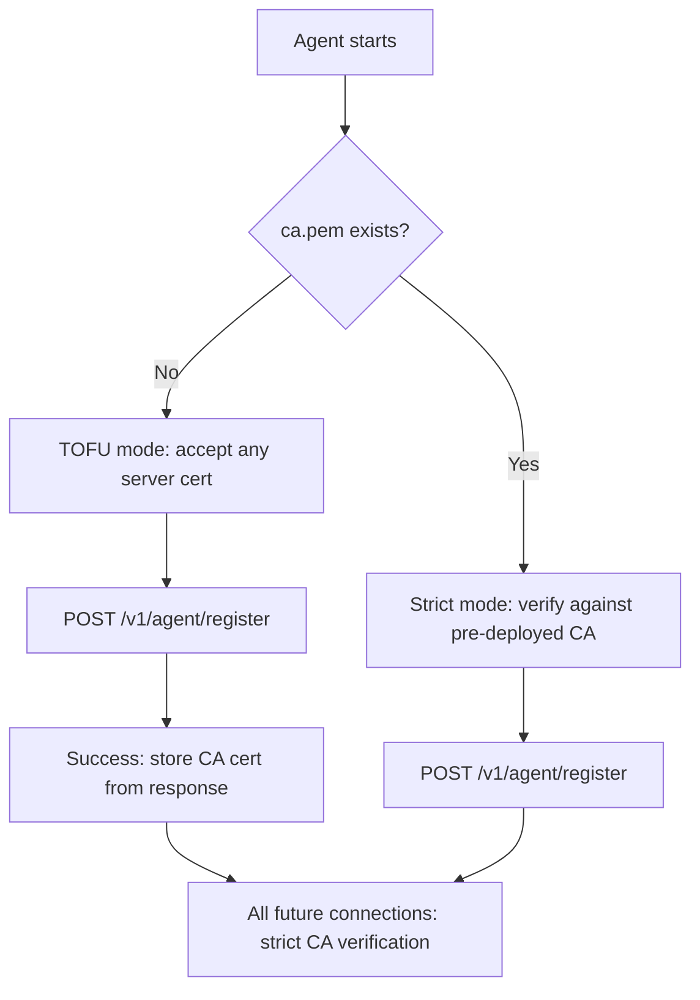

## Ports Overview

| Port | Component | Protocol | TLS | Direction | Purpose |
|------|-----------|----------|-----|-----------|---------|
| `8445` | Director | HTTPS | Server cert | Inbound | API, admin UI, launcher connections |
| `8446` | Agent | HTTPS | mTLS | Inbound | Director session management |

## Communication Flows

### Agent -> Director

| Endpoint | When | TLS | Auth | Purpose |
|----------|------|-----|------|---------|
| `POST /v1/agent/register` | First startup, or after cert loss | HTTPS (TOFU) | GUID (UUIDv4) | Submit CSR, get signed cert |
| `POST /v1/agent/renew` | Every ~12 hours | mTLS | Current cert | Submit new CSR, get renewed cert |
| `POST /v1/agent/update` | Every `update_interval` (default 30s) | mTLS | Current cert | Report sessions + system stats |

### Director -> Agent

| Endpoint | When | TLS | Purpose |
|----------|------|-----|---------|
| `POST /v1/sessions` | User requests session | mTLS | Create session on agent |
| `DELETE /v1/sessions/{id}` | User closes session | mTLS | Close session on agent |
| `POST /v1/config` | Admin changes config | mTLS | Set DCV config parameters |

### Launcher -> Director

| Endpoint | When | TLS | Auth | Purpose |
|----------|------|-----|------|---------|
| `POST /v1/user/login` | User login | HTTPS | None (credentials in body) | Authenticate, sets `dcvix_session` cookie |
| `GET /v1/user/servers` | After login | HTTPS | Session cookie | List available servers for user |
| `POST /resolveSession` | DCV Gateway | HTTPS | Gateway IP whitelist | Resolve DCV session |

## mTLS Trust Model

### Certificate Hierarchy

| Certificate | Issuer | Subject | Validity | Key type |
|-------------|--------|---------|----------|----------|
| CA | Self-signed | `dcvix CA` | 10 years | ECDSA P-256 |
| Director server | CA | `dcvix-director` + DNS names | 10 years | ECDSA P-256 |
| Agent | CA | `dcvix-agent-{guid}` | 14 days | Ed25519 |

### Agent Certificates

- **14-day validity**: short enough to limit damage from key compromise, long enough to absorb director outages
- **Renewal every ~12 hours**: missed renewal windows don't cause immediate failure
- **Key usage**: `digitalSignature` + `serverAuth` + `clientAuth` - used for both server and client mTLS

### Director Server Certificate

- **10-year validity**: practically permanent
- **Auto-generated**: DNS names include `dcvix-director`, `localhost`, the system hostname, and its FQDN
- **IP addresses**: `127.0.0.1` is included for local health checks
- **hostname -f must match**: The FQDN is resolved via `hostname -f`. Agents verify the server cert's CN/SAN against the hostname they use to reach the director - a mismatch causes connection rejection.

## Trust on First Use (TOFU)

When an agent has no pre-deployed CA cert, the first registration request connects without certificate verification (`InsecureSkipVerify: true`).

The director's CA fingerprint is logged at startup so administrators can verify it out-of-band.

In high-security environments, TOFU can be skipped entirely by bundling the director's CA certificate (`ca.pem`) with the agent installation package. The agent will then use strict certificate verification from the very first connection, eliminating the TOFU window entirely.

## HTTP API Conventions

- Most API JSON fields use `camelCase`. Agent stats use `snake_case` (`free_memory`, `cpu_usage`, `load1`). Fields from the `dcv` CLI use `kebab-case` (`num-of-connections`, `creation-time`, `last-disconnection-time`).
- Admin endpoints are under `/v1/admin/` and require admin authentication
- Agent endpoints are under `/v1/agent/` and use either TOFU or mTLS depending on the endpoint
- User endpoints are under `/v1/user/` and require a valid `dcvix_session` cookie (PASETO token)
