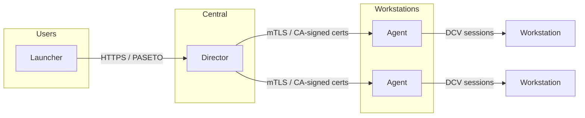
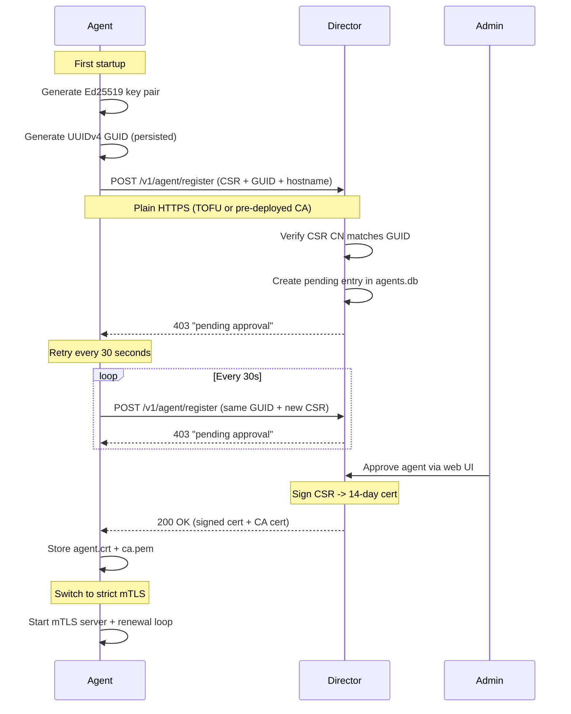
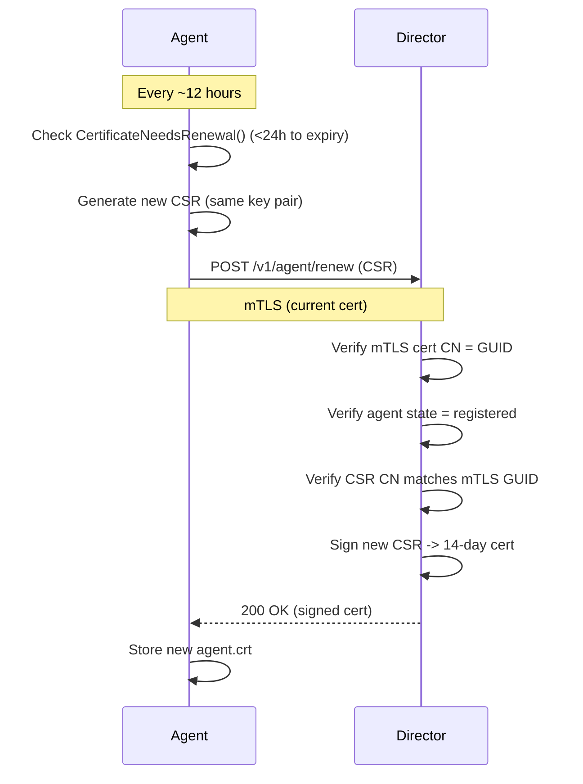
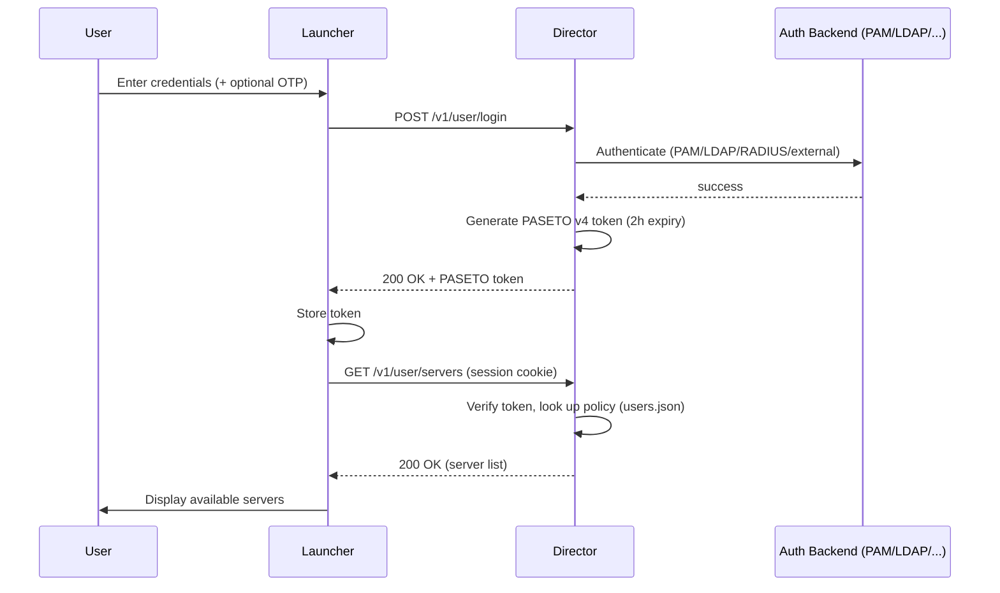
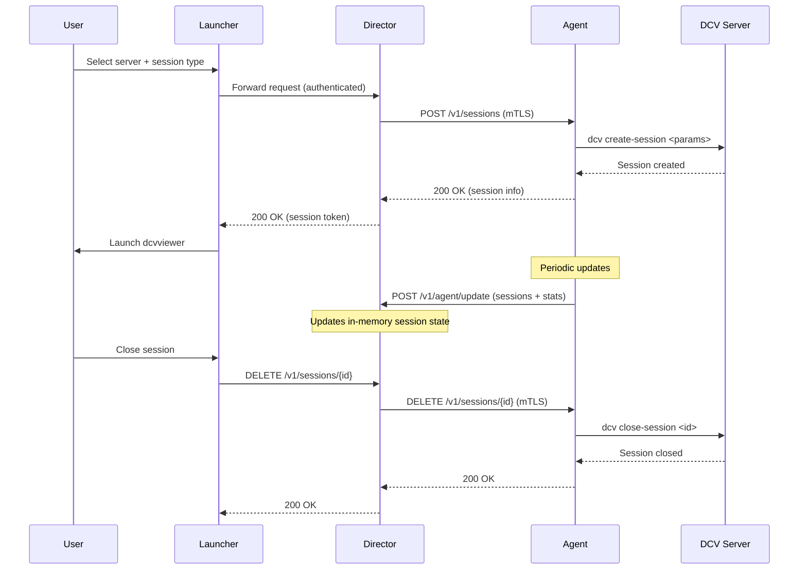

dcvix is a three-component orchestrator for Amazon DCV remote desktops. This page explains the system architecture, component relationships, and key lifecycle flows.

## Three-Tier Model

| Component | Role | Tech |
|-----------|------|------|
| **Director** | Central server - API, auth, session management, CA authority | Go + React frontend |
| **Agent** | Per-workstation - DCV session lifecycle, stats reporting, auto-cert management | Go |
| **Launcher** | End-user GUI - login, server list, launch DCV viewer | Go + Fyne toolkit |

## Agent Auto-Registration Flow

On first startup, an agent has no certificate. It generates a key pair and GUID locally, then registers with the director via a retry loop. The private key never leaves the agent.

Flow details:

- **Key generation**: Ed25519, stored at `{dataDir}/agent.key` (0600)
- **GUID**: UUIDv4, stored at `{dataDir}/agent.guid`, survives restarts
- **CSR**: CN = `dcvix-agent-{guid}`, DER-encoded, base64 in JSON
- **Director validation**: Parses CSR, verifies CN matches submitted GUID (binds GUID to public key)
- **Agent states**: `pending` -> `registered` -> `revoked`

## Certificate Renewal Flow

Once registered, the agent renews its certificate periodically (default every 12 hours). The renewal uses the existing mTLS connection.

The mTLS server uses a `GetCertificate` callback so the renewed cert is picked up without restarting the listener.

## User Authentication Flow

## Session Lifecycle

