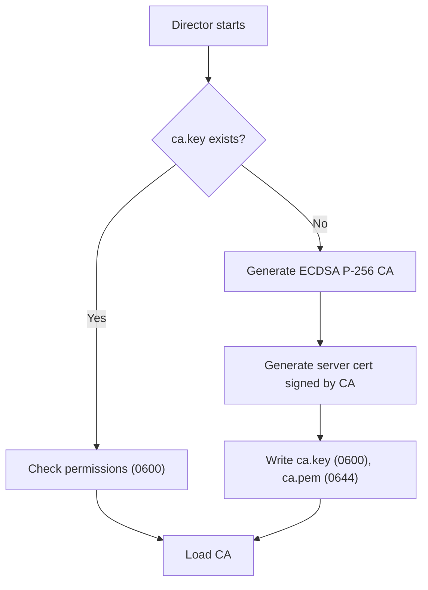
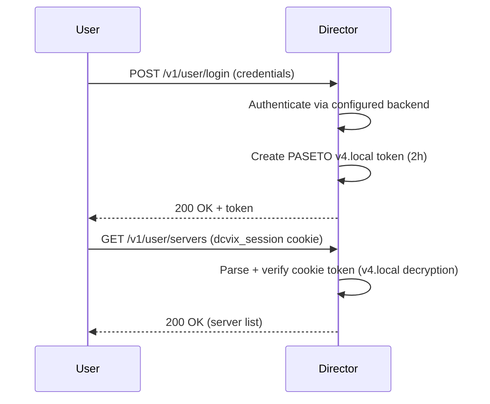
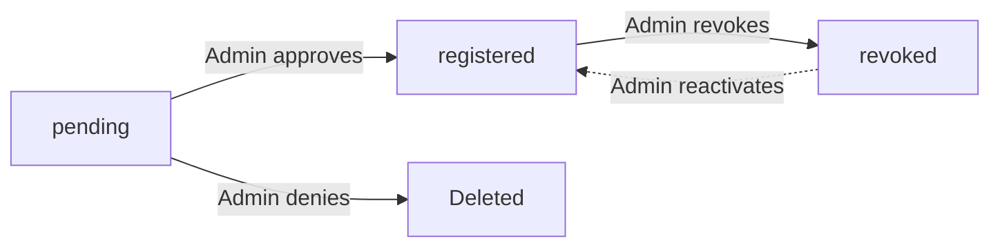

## Certificate Authority

The director is the root of trust for the entire dcvix deployment.

### CA Generation

On first startup, the director checks for existing CA files in `{dataDir}`:

- If `ca.key` and `ca.pem` exist -> load and use them (admin can pre-deploy an enterprise CA)
- If they don't exist -> generate a new ECDSA P-256 CA (self-signed, 10-year validity)



> **Important:** The auto-generated server certificate includes the hostname returned by `hostname -f` as its Common Name/SAN. Agents verify this against the hostname they use to reach the director - if they don't match, agents will reject the connection. Ensure `hostname -f` on the director resolves to the hostname agents use to connect.

### Key Permissions

All private key files are enforced to `0600` (owner read/write only). The director validates this at startup via `checkKeyPermissions()` and refuses to start if group or world permissions are set.

| File | Component | Permission | Contains |
|------|-----------|------------|----------|
| `ca.key` | Director | `0600` | CA private key |
| `server.key` | Director | `0600` | Server private key |
| `agent.key` | Agent | `0600` | Agent Ed25519 private key |

## Agent Identity

### GUID

Each agent is identified by a **UUIDv4** (122 bits of entropy), generated on first startup and persisted to `{dataDir}/agent.guid`.

- Survives restarts - the agent retries registration with the same GUID
- Embedded in the CSR's Common Name as `dcvix-agent-{guid}`
- Acts as a lookup key in the director's `agents.db`

### CSR Binding

The director validates that the CSR's CN matches `dcvix-agent-{submitted_guid}`. This binds the GUID to the agent's public key:

- An attacker cannot replay a stolen CSR with a different GUID
- An attacker cannot register their own key under a stolen GUID

## Proof of Possession

The director never signs a CSR without verifying the agent possesses the corresponding private key. This is enforced by `x509.ParseCertificateRequest()`, which verifies the CSR's self-signature before the director's CA signs it.

```go
csr, err := x509.ParseCertificateRequest(csrDER)
// If the signature is invalid (agent doesn't have the private key),
// parsing fails and SignCSR returns an error.
```

The private key **never leaves the agent**.

## Authentication

### User Authentication

The director supports multiple authentication backends configured via `auth_type`:

| Backend | Protocol | OTP support |
|---------|----------|-------------|
| PAM | Pluggable Authentication Modules | Indirect (PAM module) |
| LDAP | LDAP bind | Built-in |
| RADIUS | RADIUS authenticate | Indirect |
| External | Custom command (`UserID\nPassword\nOTP\n` on stdin) | Indirect |

OTP can be added via:

- **PrivacyIDEA**: external OTP server, calls `POST /validate/check` route
- **External command**: custom OTP verification script

### PASETO Tokens

The director uses **PASETO v4.local** (encrypted, symmetric-key) tokens for session management:

- **Format**: `v4.local.<encrypted_payload>`
- **Expiry**: 2 hours from issuance
- **Claims**: `userID`, `userCategory`, `iat` (issued at), `nbf` (not before), `exp` (expiration)
- **Key**: Symmetric key from config (`token_key`, base64-encoded), or auto-generated on startup



### Token Persistence

If `token_key` is not set in the director config, a new ephemeral key is generated on every startup. **This invalidates all existing tokens** - users must log in again after each restart.

To persist tokens across restarts, set `token_key` in `dcvix-director.conf`:

```ini
[director]
token_key = "<base64-key>"
```

The key is logged once on startup if auto-generated. Copy it from the warning block in the logs.

## Agent State Machine



| State | Meaning | Transition |
|-------|---------|------------|
| `pending` | GUID received, awaiting admin approval | -> `registered` on approve -> deleted on deny |
| `registered` | Agent has valid cert, participating normally | -> `revoked` on admin deactivation |
| `revoked` | Renewals rejected, agent cannot participate | -> `registered` on reactivation |

## Failure Mode Security Analysis

| Scenario | Impact | Mitigation |
|----------|--------|------------|
| `agents.db` lost | All agents appear unknown, must re-register | Agents keep GUID + key - same identity after re-approval |
| CA + `agents.db` lost | New CA generated, all existing certs invalid | Agents register as new - all need approval |
| Agent cert only lost | Agent keeps key + GUID, re-registers | If GUID was registered, previous entry orphaned, housekeeper cleans |
| Agent key + cert lost | Fresh state: new key, new GUID, new pending entry | Admin approves |
| Agent key + cert + GUID lost | Fresh state | Admin approves |
| Network blip | Renewal fails, retries every 5min | Cert valid for 14 days, tolerant of extended outages |
| MITM on first registration | TOFU mode accepts any server cert | Pre-deploy `ca.pem` via the agent package to skip TOFU entirely — the agent starts in strict verification mode from the first connection. Director CA fingerprint logged for out-of-band verification. |
| Registration endpoint unauthenticated | GUID acts as one-time token (122-bit UUIDv4) | High-security: add optional `registration_token` config field |

## Housekeeper Cleanup

The housekeeper runs two cleanup loops:

| Goroutine | Cadence | Cleanup |
|-----------|---------|---------|
| Runtime vacuum | Configurable (default 40s) | Stale sessions/servers |
| Agent cleanup | Hourly | `registered` agents with `last_seen_at > 30d`, `pending` agents with `created_at > 7d` |

## Security Considerations Summary

| Concern | Mitigation |
|---------|------------|
| Agent private key exposure | Ed25519 key, `0600` permissions, stored only on agent filesystem  |
| CA key exposure | `0600` permissions, stored only on director filesystem, no config field |
| Token forgery | PASETO v4 encrypted tokens, symmetric key from config |
| Replay attacks | Token expiry (2h), CSR proof-of-possession per registration |
| Revocation | Set agent state to `revoked`, reject renewals. Within 12h max the cert expires naturally. |
| No CRL/OCSP | Short cert lifetimes (14 days) + frequent renewal (12h) limit compromise window |
