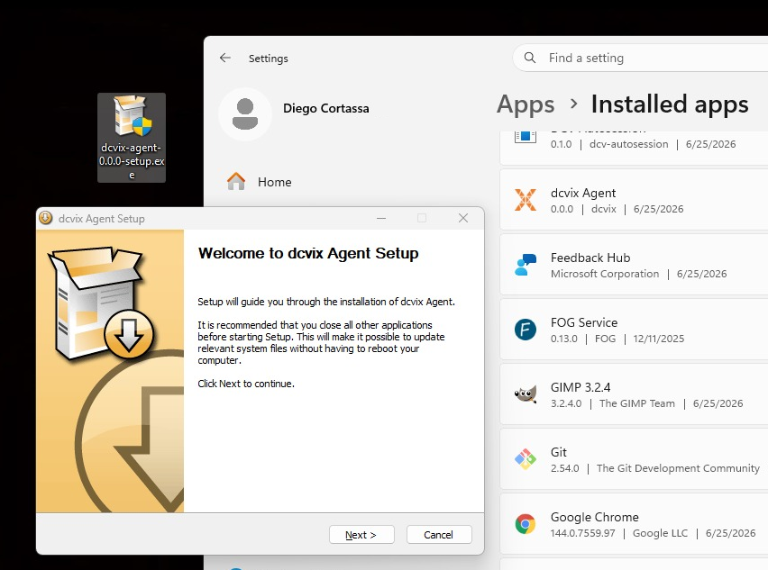
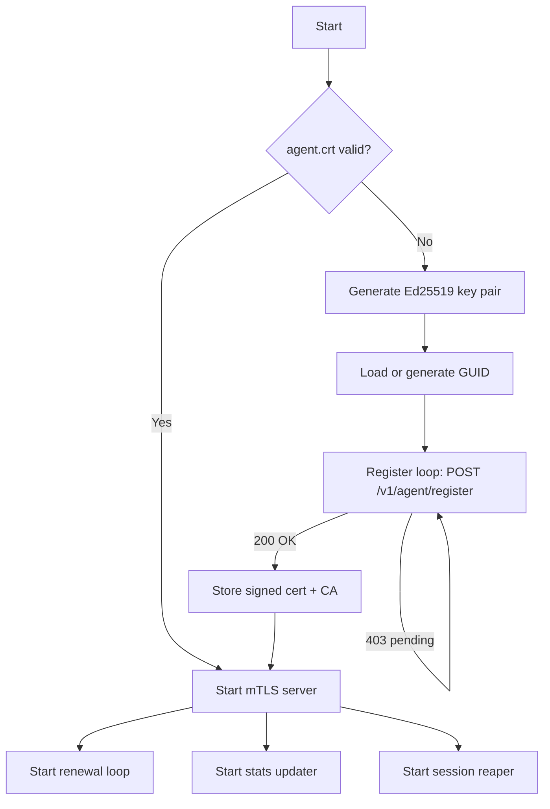

The agent runs on each DCV workstation. It manages local Amazon DCV sessions, reports system statistics to the director, and handles certificate lifecycle (auto-registration and renewal).



## Responsibility

- Register with the director automatically on first startup (Ed25519 key pair + GUID + CSR)
- Renew its TLS certificate before expiry (every ~12 hours by default)
- Create, list, and close local DCV sessions via the `dcv` CLI
- Report system stats (memory, CPU, load) and active sessions to the director periodically
- Clean up stale idle sessions (configurable reaper interval)
- Serve a REST API for the director to request session operations

## Lifecycle



### Phases

1. **Key generation** - `certificate.Manager.EnsureKeyPair()` generates Ed25519 key on first run, stores at `{dataDir}/agent.key` (0600)
2. **GUID generation** - `EnsureGUID()` creates UUIDv4, persists to `{dataDir}/agent.guid`
3. **Registration** - `registrator.Registrator.Register()` loops every 30s: generates CSR with CN `dcvix-agent-{guid}`, POSTs TOFU HTTPS to director, waits for admin approval
4. **Active service** - starts mTLS server once `agent.crt` and `ca.pem` exist, begins renewal + stats + reaper loops
5. **Renewal** - `renewer.Renewer` checks `CertificateNeedsRenewal()` (24h window), POSTs fresh CSR via mTLS to `/v1/agent/renew`

## Inputs / Outputs

| Direction | Method | Content |
|-----------|--------|---------|
| Director in | `POST /v1/sessions` | Create session (UserID, SessionType, SessionID) |
| Director in | `DELETE /v1/sessions/{id}` | Close session |
| Director in | `POST /v1/config` | Set DCV config parameters |
| Out to director | `POST /v1/agent/register` | CSR + GUID + hostname (plain HTTPS, TOFU) |
| Out to director | `POST /v1/agent/renew` | CSR (mTLS) |
| Out to director | `POST /v1/agent/update` | Sessions list + stats + tags (mTLS, every `update_interval`) |
| Out | `dcv` CLI | Create/list/close sessions via the system DCV binary |

All endpoints except `/v1/health` require mTLS authentication by the director (validated via director-issued CA).

## API Endpoints

| Method | Endpoint | Description |
|--------|----------|-------------|
| GET | `/v1/health` | Health status of the agent |
| GET | `/v1/sessions` | List all active DCV sessions |
| POST | `/v1/sessions` | Create a new DCV session |
| DELETE | `/v1/sessions/{id}` | Close a DCV session |
| POST | `/v1/config` | Set DCV configuration parameters |
| GET | `/v1/stats` | Return session list and system stats for the director |

### POST /v1/sessions

Request body:

```json
{
    "userId": "USERNAME",
    "sessionType": "console",
    "sessionId": "SESSIONNAME"
}
```

### POST /v1/config

Request body:

```json
{
    "config": [
        {
            "section": "display",
            "key": "quality",
            "value": "(30,80)"
        }
    ]
}
```

## curl Examples

All agent API calls (except `/v1/health`) require mTLS authentication with director-issued certificates, verified against the director's CA.

### Health

```bash
curl --cert dcvix-director.crt --key dcvix-director.key --cacert ca-cert.pem \
     https://127.0.0.1:8446/v1/health
```

### List Sessions

```bash
curl --cert dcvix-director.crt --key dcvix-director.key --cacert ca-cert.pem \
     https://127.0.0.1:8446/v1/sessions
```

### Create a New Session

```bash
curl --cert dcvix-director.crt --key dcvix-director.key --cacert ca-cert.pem \
     -X POST \
     -H "Content-Type: application/json" \
     -d '{"userId": "john", "sessionType": "console", "sessionId": "test"}' \
     https://127.0.0.1:8446/v1/sessions
```

### Close a Session

```bash
curl --cert dcvix-director.crt --key dcvix-director.key --cacert ca-cert.pem \
     -X DELETE \
     https://127.0.0.1:8446/v1/sessions/test
```

### Set Compression Quality

```bash
curl --cert dcvix-director.crt --key dcvix-director.key --cacert ca-cert.pem \
     -X POST \
     -H "Content-Type: application/json" \
     -d '{"config": [{"section": "display", "key": "quality", "value": "(30,80)"}]}' \
     https://127.0.0.1:8446/v1/config
```

## Internal Packages

| Package | Role |
|---------|------|
| `certificate/` | Ed25519 key pair, GUID, CSR generation, cert/CA storage, `CertificateNeedsRenewal()` |
| `registrator/` | Retry loop (30s), TOFU or pre-deployed CA, stores signed cert on success |
| `renewer/` | Periodic renewal (configurable, default 12h), retry every 5min on failure |
| `dcv/` | Wraps `dcv` binary: create-session, list-sessions, close-session, set-config |
| `stats/` | System statistics collection (memory, CPU, load) |
| `updater/` | Periodic POST of sessions + stats to director |
| `reaper/` | Cleanup of stale idle sessions (configurable interval, default 60s) |
| `server/` | REST API + mTLS with `GetCertificate` callback for hot-reload |
| `client/` | HTTP clients - `NewRegistrationClient()` (TOFU) and `NewMTLSClient()` (strict) |

## Failure Modes

| Scenario | Behavior |
|----------|----------|
| Director unreachable | Registration or renewal retries. Cert valid for 14 days - tolerant of extended outages. |
| Cert expired | Falls back to fresh registration (same GUID, same key - re-approval needed). |
| `agent.key` lost | Generates new key + new GUID on next start. Registers as a completely new agent. |
| `agent.crt` lost (key + GUID intact) | Re-registers with same GUID. Director sees pending for an already-registered GUID, admin approves. |
| `dcv` binary missing or fails | Returns error to director on session operations; stats reporting continues unaffected. |
| `data_dir` permissions wrong | Startup fails if `data_dir` cannot be created or written to. |

## Related

- [Agent configuration](../configuration/agent.md) - all config fields and defaults
- [Architecture: communication](../architecture/communication.md) - protocol details
- [Architecture: security](../architecture/security.md) - trust model and TOFU
