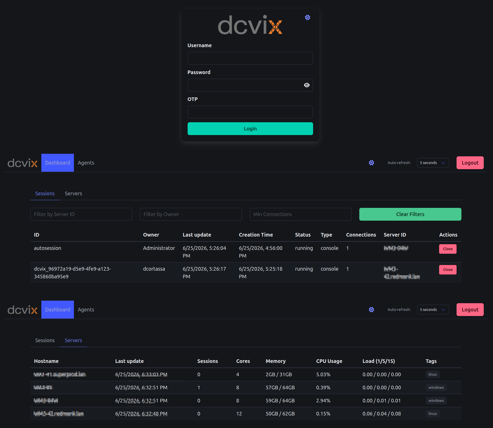

The director is the central management service. It runs on a server and provides the REST API, admin web UI, CA authority, and user authentication for the dcvix session broker.



## Responsibility

- Manage agent registrations and certificate lifecycle (auto-registration, renewal, revocation)
- Authenticate users via PAM, LDAP, RADIUS, or external commands (with optional OTP via PrivacyIDEA or external scripts)
- Issue and verify PASETO v4 encrypted tokens for user and admin sessions
- Maintain session and server state by collecting updates from agents
- Enforce access policy via JSON-based user-to-server and pool-to-server mappings
- Act as DCV auth token verifier for DCV sessions and DCV Gateway session resolution
- Serve the React-based admin web UI for agent lifecycle management

## Lifecycle


1. **Config load** - reads `dcvix-director.conf`, applies defaults
2. **CA init** - `ca.NewSigner(dataDir)` loads existing CA or auto-generates ECDSA P-256 CA + server cert (see `ca/signer.go`). The server cert's CN/SAN includes the hostname from `hostname -f` - agents verify this against the hostname they connect to, so they must match.
3. **DB init** - runtime session DB (in-memory SQLite) and policy DB (in-memory loaded from JSON files)
4. **Agent DB init** - persistent SQLite at `{dataDir}/agents.db` for agent registrations
5. **Server start** - HTTPS + mTLS listener on `director_host:director_port`, routes registered
6. **Runtime** - serves API, collects agent updates, runs housekeeper cleanup
7. **SIGHUP** - reloads policy JSON files without restart

## Inputs / Outputs

| Direction | Method | Content |
|-----------|--------|---------|
| Agent in | `POST /v1/agent/register` | CSR + GUID + hostname (plain HTTPS) |
| Agent in | `POST /v1/agent/renew` | CSR (mTLS) |
| Agent in | `POST /v1/agent/update` | Session list + system stats + tags (mTLS) |
| User in | `POST /v1/user/login` | UserID + password + optional OTP |
| Admin in | `POST /v1/admin/login` | Admin credentials |
| Launcher in | `GET /v1/user/servers` | Server list for authenticated user |
| Out to agent | `POST /v1/sessions` | Create session request (forwarded from user) |
| Out | Signed cert | To agent on successful register/renew |
| Out | PASETO token | To user/admin on successful login |

## Internal Packages

| Package | Role |
|---------|------|
| `ca/` | CA auto-generation, CSR signing (14-day agent certs, 10-year CA) |
| `database/` | SQLite via GORM - runtime sessions (in-memory) + agents (persistent) |
| `auth/` | PAM, LDAP, RADIUS, external command authentication |
| `token/` | PASETO v4.local token creation (2h expiry) and verification |
| `client/` | mTLS HTTP client for outbound agent communication |
| `housekeeper/` | Periodic cleanup - runtime sessions (40s default) + stale agent registrations (hourly) |
| `models/` | GORM models including `AgentRegistration` (agents table) |
| `server/` | HTTP + mTLS with `GetCertificate` callback for hot-reload |
| `frontend/` | React SPA embedded via `frontend.go` |

## API Endpoints

| Method | Endpoint | Auth | Description |
|--------|----------|------|-------------|
| GET | `/v1/health` | None | Health check |
| GET | `/v1/auth-health` | Auth | Health check with authentication |
| POST | `/v1/logout` | None | Clears session cookie |
| POST | `/v1/agent/register` | None (TOFU) | Agent registration via CSR + GUID + hostname. Returns 403 pending until admin approves, then returns signed cert + CA + agentId. |
| POST | `/v1/agent/renew` | mTLS | Agent certificate renewal. Sends base64 DER CSR, returns signed PEM cert. |
| POST | `/v1/agent/update` | mTLS | Receives agent updates (sessions + stats + tags) |
| POST | `/v1/admin/login` | None | Admin authentication, checks IsAdmin policy, sets session cookie |
| GET | `/v1/admin/agents` | Admin | List agent registrations. Query: `?state=pending|registered|revoked` |
| POST | `/v1/admin/agents/{guid}/approve` | Admin | Approve a pending agent |
| POST | `/v1/admin/agents/{guid}/deny` | Admin | Deny and remove a pending agent |
| POST | `/v1/admin/agents/{guid}/revoke` | Admin | Revoke a registered agent |
| POST | `/v1/user/login` | None | User authentication, sets session cookie |
| POST | `/v1/user/authtokenverify` | None | DCV auth token verification (reads form value `authenticationToken`, returns XML) |
| GET | `/v1/user/servers` | Auth | Server list (and pool members) accessible to the authenticated user |
| GET | `/v1/user/connectiontoken` | Auth | PASETO token for DCV connection. Query: `?sessionId=X&serverId=Y` |
| POST | `/v1/user/sessions` | Auth | Create a session on an agent. Body: `{"serverId": "...", "sessionType": "..."}` |
| POST | `/v1/user/servers/{server}/config` | Auth | Set DCV config parameters on a server |
| GET | `/v1/sessions` | Admin | List all known sessions |
| POST | `/v1/sessions` | Admin | Create a new session on an agent. Body: `{"serverId": "...", "userId": "...", "sessionId": "...", "sessionType": "..."}` |
| DELETE | `/v1/sessions/{id}` | Admin | Close a session (sends close to agent) |
| GET | `/v1/servers` | Admin | List all known servers with their associated sessions |
| POST | `/resolveSession` | Gateway IP | DCV Gateway session resolution |

## curl Examples

### Admin Login

```bash
curl --cacert ca.pem \
  --cookie-jar cookies.txt \
  -X POST https://127.0.0.1:8445/v1/admin/login \
  -d '{"userID": "'$USERNAME'", "password": "'$PASSWORD'"}'
```

### List Sessions

```bash
curl --cacert ca.pem \
    --cookie cookies.txt \
    https://127.0.0.1:8445/v1/sessions
```

### Close Session

```bash
curl --cacert ca.pem \
    --cookie cookies.txt \
    -X DELETE \
    https://127.0.0.1:8445/v1/sessions/SESSION_ID
```

### Agent Update

```bash
curl --cert agent.crt --key agent.key --cacert ca.pem \
    -X POST \
    -H "Content-Type: application/json" \
    -d '{
      "sessions": [],
      "stats": {
        "hostname": "server.domain.com",
        "free_memory": 54545088512,
        "total_memory": 66996871168,
        "cores": 8,
        "cpu_usage": 1.16,
        "load1": 0.11,
        "load5": 0.13,
        "load15": 0.15
      },
      "tags": ["tag1", "tag2"]
    }' \
    https://127.0.0.1:8445/v1/agent/update
```

### DCV Gateway Session Resolution

```bash
curl --noproxy '*' --cacert ca.pem \
    -X POST \
    -H "Content-Type: application/json" \
    -d '{"sessionId": "autosession", "transport": "XXXX", "clientIpAddress": "127.0.0.1"}' \
    https://127.0.0.1:8445/resolveSession
```

## Failure Modes

| Scenario | Behavior |
|----------|----------|
| `agents.db` lost | Recreated empty on startup. Agents re-register with their persisted GUID; admin must re-approve. |
| CA (`ca.key`) lost | Auto-regenerated on startup. All existing agents must re-register (old certs signed by different CA are invalid). |
| `token_key` not set | Generated ephemerally on each startup - all existing PASETO tokens become invalid on restart. Set `token_key` in config for persistence. |
| Agent unreachable | Session create/close operations fail. Director returns error to the caller. |
| Policy JSON corrupt | SIGHUP logs error, keeps last valid policy in memory. |

## Related

- [Director configuration](../configuration/director.md) - all config fields and defaults
- [Architecture overview](../architecture/overview.md) - system positioning
