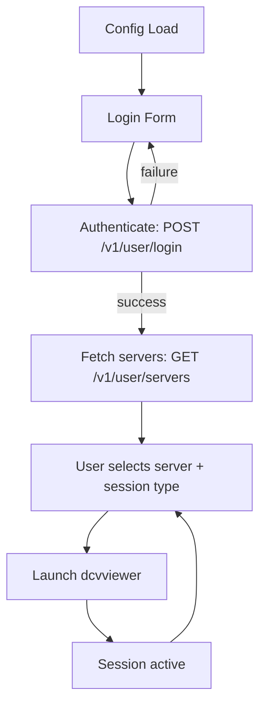

The launcher is the GUI client that runs on the user's computer. It authenticates users against the director, displays available DCV servers, and launches the DCV viewer.

Written in Go with the Fyne toolkit, it runs on Linux, Windows and macOS.

## Installers

| Platform | Package / File |
|----------|----------------|
| Debian / Ubuntu | `dcvix-launcher_<VERSION>.deb` |
| Rocky Linux / RHEL | `dcvix-launcher-<VERSION>.rpm` |
| Windows | NSIS installer |
| macOS | `dcvix-launcher-v<VERSION>-darwin-amd64` tarball |

## Responsibility

- Provide a cross-platform graphical interface (Linux, Windows, macOS) using the Fyne toolkit
- Authenticate users against the director via PASETO-based login
- Display a list of available DCV servers based on the authenticated user's policy
- Launch the DCV viewer (`dcvviewer`) with the appropriate connection parameters
- Support OTP authentication when required by the director configuration

## Lifecycle

1. **Config load** - discovers `dcvix-launcher.conf` (user config dir / working dir / executable dir), writes defaults if absent
2. **Login** - presents login form (username, password, optional OTP field), POSTs credentials to director
3. **Server list** - on successful authentication, fetches the list of servers the user has access to (from policy JSON files)
4. **Session launch** - user picks a server and session type, launcher invokes `dcvviewer` with the appropriate arguments
5. **Runtime** - user can switch servers, launch new sessions, or log out

## Inputs / Outputs

| Direction | Method | Content |
|-----------|--------|---------|
| User in | Login form | UserID + password + optional OTP |
| User in | Server selection | Server hostname + session type |
| Out to director | `POST /v1/user/login` | User credentials |
| Out to director | `GET /v1/user/servers` | Server list request (authenticated) |
| Out | `dcvviewer` process | Launch with selected server + token |

## Internal Packages

| Package | Role |
|---------|------|
| `gui/` | Fyne UI widgets - login form, server list, preferences dialog |
| `client/` | HTTP client for director API calls (login, server list) |
| `service/` | Business logic - orchestrates auth flow, server list fetching, viewer launch |
| `config/` | Configuration file loading |

## Failure Modes

| Scenario | Behavior |
|----------|----------|
| Director unreachable | Login fails with error message. User cannot proceed. |
| Invalid credentials | Login form resets with error; user retries. |
| OTP required but not configured on launcher | Login form shows OTP field based on director response. |
| `dcvviewer` not found | Error displayed; user can configure custom path in `command` config option. |
| No servers assigned | Server list is empty; user sees no available connections. |

## Related

- [Launcher configuration](../configuration/launcher.md) - all config fields and defaults
- [Architecture: communication](../architecture/communication.md) - protocol details
