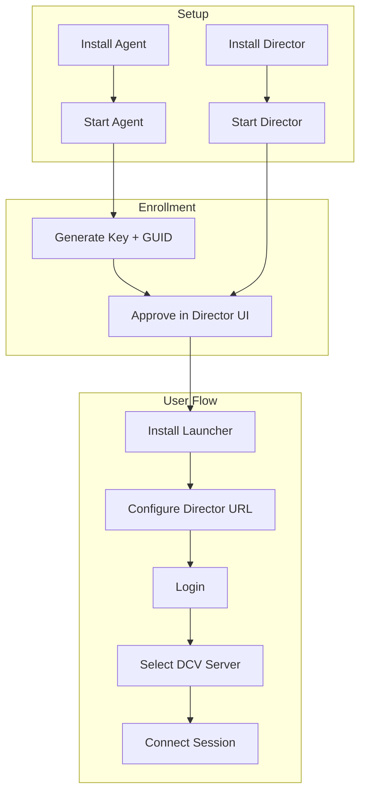

This section covers everything you need to install, configure, and run your first dcvix deployment.

## Prerequisites

- One Linux server for the **director** (the central management service)
- One or more Linux or Windows workstations with Amazon DCV installed for **agents**
- End-user desktops (Linux, Windows, or macOS) for the **launcher**

## Installation flow

- [Quickstart](quickstart.md) - get running in 5 minutes
- [Installation](installation.md) - detailed install options per platform
