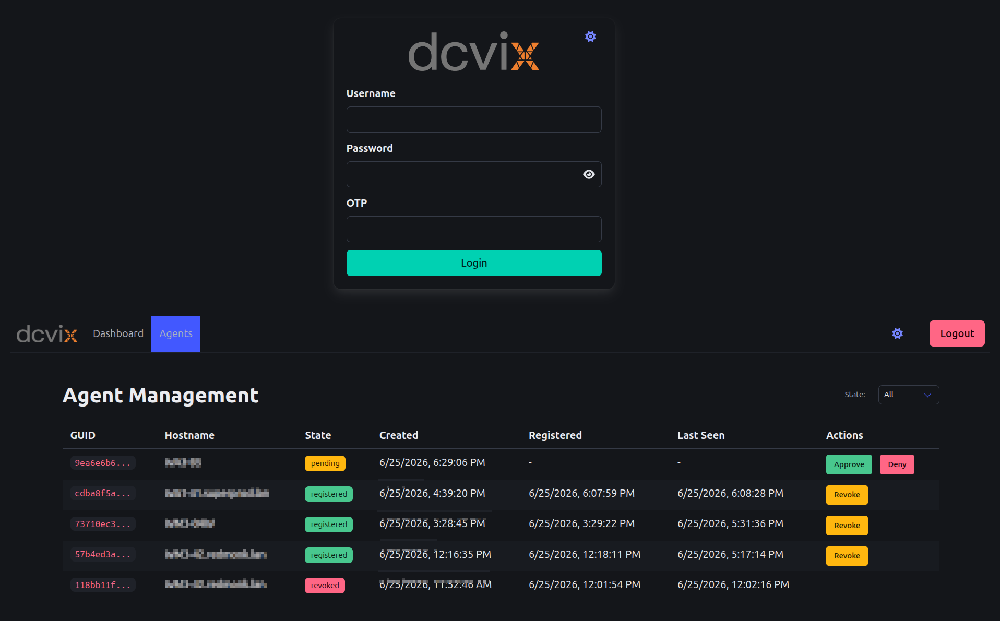

This guide gets a minimal dcvix deployment running on a single Linux server with one agent workstation.

## 1. Install the Director

```bash
# Debian / Ubuntu
sudo dpkg -i dcvix-director_<version>.deb

# Rocky Linux / RHEL
sudo rpm -i dcvix-director-<version>.rpm
```

On first startup the director auto-generates its CA, server certificate, and creates the SQLite agent database.

> **Important:** The server certificate's CN/SAN is set from `hostname -f`. Agents verify this against the hostname they use to reach the director - they must match or agents will reject the connection.

## 2. Configure the Director

Edit `/etc/dcvix-director/dcvix-director.conf`:

```ini
[director]
director_host = "0.0.0.0"
director_port = 8445
auth_type = "pam"
policydb_folder = "/etc/dcvix-director/policydb"
data_dir = "/var/lib/dcvix-director"
```

Create a minimal policy file so the launcher user can see servers:

```bash
mkdir -p /etc/dcvix-director/policydb
```

```json
# /etc/dcvix-director/policydb/users.json
[
    {
        "UserID": "your-username",
        "Workstations": ["agent-hostname.domain.com"],
        "Pools": []
    }
]
```

```json
# /etc/dcvix-director/policydb/pools.json
[]
```

## 3. Start the Director

```bash
sudo systemctl enable --now dcvix-director
```

Check the logs:

```bash
journalctl -u dcvix-director -f
```

Look for the CA fingerprint and a line confirming the server started on port 8445.

## 4. Install the Agent

On a workstation with Amazon DCV installed:

```bash
sudo dpkg -i dcvix-agent_<version>.deb
```

## 5. Configure the Agent

Edit `/etc/dcvix-agent/dcvix-agent.conf`:

```ini
[agent]
director_host = "<director-ip-address>"
director_port = 8445
tags = "production, linux"
```

## 6. Start the Agent

```bash
sudo systemctl enable --now dcvix-agent
```

The agent generates an Ed25519 key pair, creates a UUIDv4 GUID, and starts polling the director's `/v1/agent/register` endpoint every 30 seconds.

Check the logs:

```bash
journalctl -u dcvix-agent -f
```

Expect to see: `"Registration: pending approval (GUID: ...) - pending approval"`

## 7. Approve the Agent

Open a browser and navigate to `https://<director-ip>:8445/admin/agents`.

Log in with your admin credentials.



Click **Approve** on the pending agent entry. The agent receives a signed certificate and switches to strict mTLS.

## 8. Install and Configure the Launcher

On your desktop, run the launcher installer or binary. On first run it creates a default config at the user config directory. Edit it to set your broker:

- Linux: `~/.config/net.cortassa.dcvix-launcher/dcvix-launcher.conf`
- macOS: `~/Library/Application Support/net.cortassa.dcvix-launcher/dcvix-launcher.conf`
- Windows: `%AppData%/net.cortassa.dcvix-launcher/dcvix-launcher.conf`

```ini
[dcvix-launcher]
broker=https://<director-ip>:8445
otp=False
command="dcvviewer"
```

## 9. Connect

Launch the GUI, enter your credentials, and you should see the agent workstation listed. Select it and click connect.


## What's next?

- [Installation guide](installation.md) - platform-specific install details
- [Configuration overview](../configuration/index.md) - all available options
- [Architecture overview](../architecture/overview.md) - understanding the system
