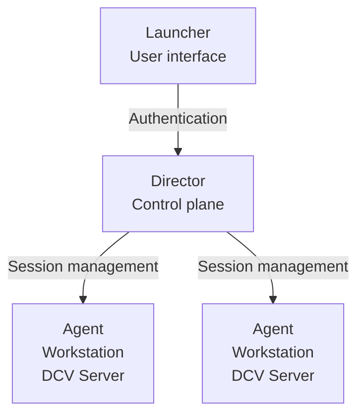
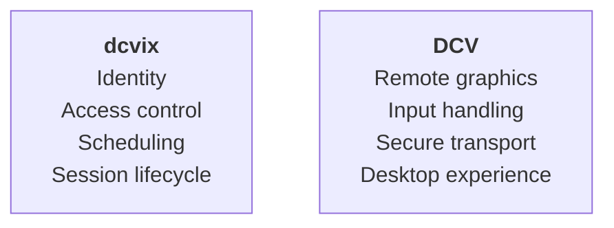

# Why dcvix exists

Amazon DCV is a powerful remote desktop protocol designed for high-performance visualization and remote workstation access. It provides excellent streaming performance, low latency interaction, and secure communication between users and remote systems.

However, deploying DCV in a small or medium-sized organization often requires building an additional management layer around it.

Organizations typically need a way to answer simple questions:

* Who is allowed to access a desktop?
* Which workstation should a user connect to?
* How are sessions created and terminated?
* How can administrators manage a pool of remote machines?
* How can users connect without knowing server addresses or technical details?

This is the problem dcvix solves.

## What is dcvix?

dcvix is a lightweight open-source session broker for Amazon DCV remote desktops.

It provides the management layer around DCV while keeping the architecture simple:

* **DCV handles the remote desktop experience**

    * high-performance display streaming
    * keyboard and mouse input
    * secure communication
    * application rendering

* **dcvix handles the organization and control**

    * authentication
    * user access control
    * server pools
    * session lifecycle
    * workstation management

The goal is not to replace DCV, but to make it easier to deploy and operate.

## Designed for small and medium-sized environments

Large enterprises often use complex VDI platforms with extensive infrastructure and management components.

Many organizations do not need that complexity.

A typical dcvix deployment might look like:

* GPU workstations that easily scale from a few to many
* a small engineering or research team
* shared visualization machines
* internal remote desktops
* controlled access to specialized hardware

dcvix provides the essential orchestration layer without requiring a large VDI stack.

## Architecture

dcvix consists of three components:

## Director

The Director is the central management component.

It provides:

* user authentication
* access control
* security token generation
* desktop availability management
* session orchestration

The Director decides where and how users connect.

## Agent

The Agent runs on machines hosting DCV sessions.

It provides:

* workstation monitoring
* hardware and availability information
* session creation
* session termination
* communication with the Director

Agents allow the Director to manage a pool of DCV-enabled machines.

## Launcher

The Launcher is the user-facing application.

It provides:

* a simple graphical interface
* user authentication
* available desktop discovery
* automatic DCV connection

Users do not need to know:

* server names
* IP addresses
* session identifiers
* DCV configuration details

They simply authenticate, choose a desktop, and connect.

## Simple by design

dcvix focuses on a small operational footprint:

* written in Go
* lightweight components
* easy deployment
* minimal dependencies
* open-source under the MIT license

The objective is to provide a practical DCV management solution that can run anywhere, from a small lab environment to a production workstation pool.

## The relationship between DCV and dcvix

Think of DCV as the remote desktop engine.

Think of dcvix as the system that decides who can use that engine.

Together they provide a simple, secure, and manageable remote desktop platform.
